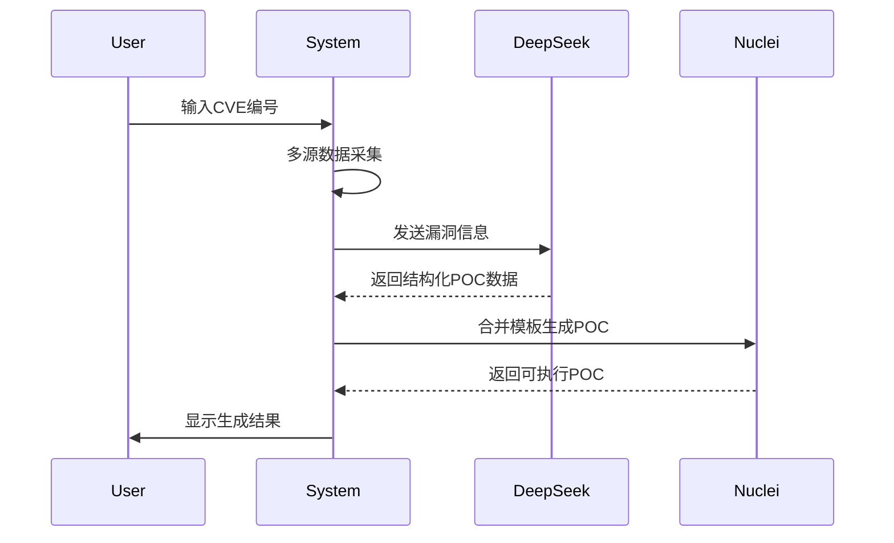
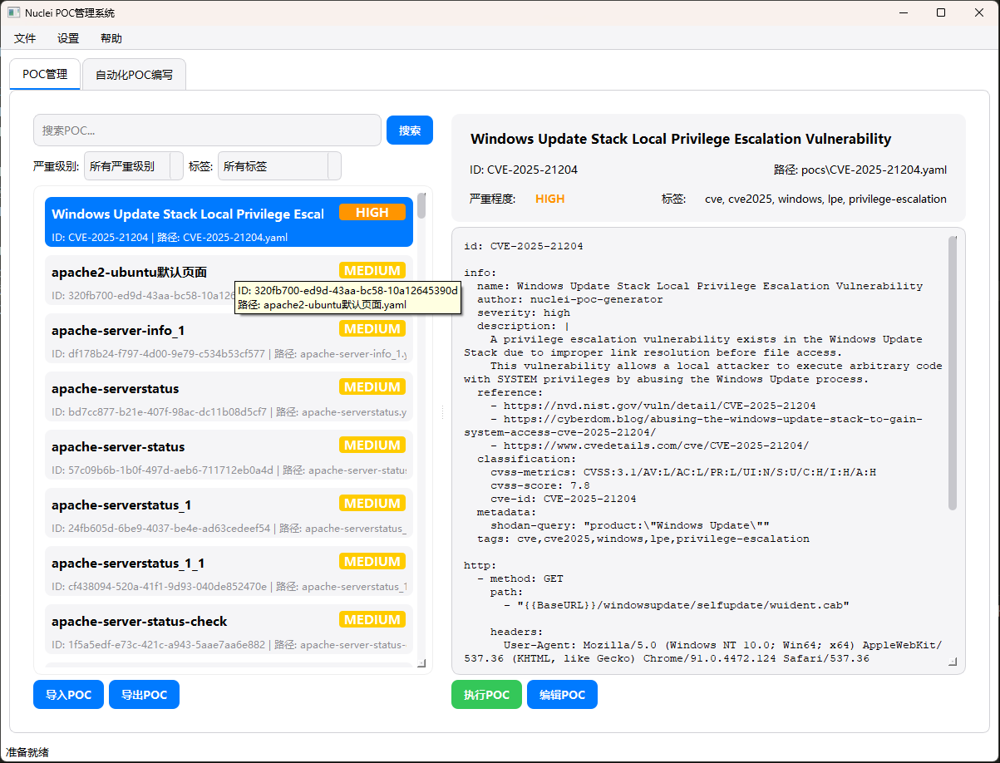
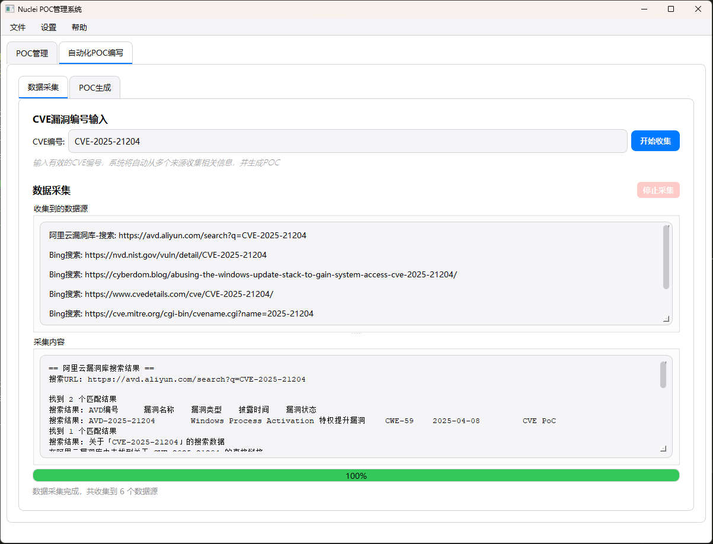
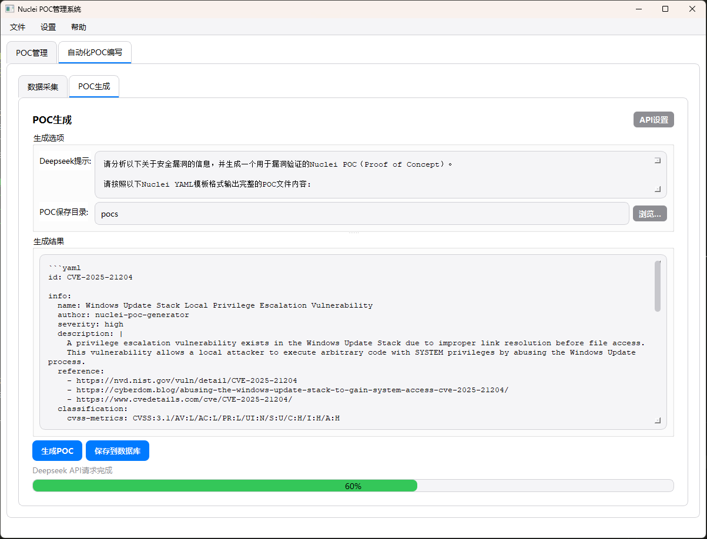

# 🚀 Nuclei POC 管理系统

<p align="center">
  
  
  
  
</p>

> 专业的 Nuclei POC 管理解决方案，集成了 AI 驱动的自动化 POC 生成功能

**Nuclei POC 管理系统**是一款强大的桌面应用程序，专为安全研究人员和渗透测试人员设计，提供 Nuclei POC 的集中管理、智能生成和快速验证功能，大幅提升漏洞验证效率。

<br/>

## ✨ 核心功能

### 🗃️ POC 管理
- **批量导入/导出**：支持本地 POC 文件的批量操作
- **智能分类**：按漏洞类型、严重等级等自动分类
- **高级搜索**：关键词、模糊搜索、标签筛选等多维度检索
- **即时预览**：在界面内直接查看 POC 内容
- **一键验证**：快速执行 POC 测试

### 🤖 AI 驱动自动化
- **CVE 智能分析**：通过 CVE 编号自动收集漏洞信息
- **多源数据采集**：整合阿里云漏洞库、Bing 搜索、NVD 等数据源
- **AI POC 生成**：利用 DeepSeek 生成结构化 POC 数据
- **模板自动合成**：智能合并 JSON 数据与 Nuclei 模板

<br/>

## ⚙️ 安装指南

### 系统要求
- Python 3.7+
- 支持系统：Windows, Linux, macOS

### 快速安装
```bash
# 克隆仓库
git clone https://github.com/Ouniel/nuclei-poc-manager.git
cd nuclei-poc-manager

# 安装依赖
pip install -r requirements.txt

# 启动应用
python main.py
```

### 首次配置
1. 在 "自动化POC编写" 标签页中点击 "API设置" 按钮
2. 输入您的 DeepSeek API 密钥
3. 保存配置并重启应用

<br/>

## 🖥️ 使用指南

### POC 管理流程


### AI POC 生成流程


<br/>

## 📁 目录结构

```
project_root/
├── poc_management/        # POC管理核心模块
│   ├── database.py        # JSON数据库处理
│   └── views.py           # 管理界面视图
├── deepseek_automation/   # AI自动化模块
│   ├── api.py             # Deepseek API接口
│   ├── collector.py       # 多源数据采集
│   ├── generator.py       # POC生成引擎
│   └── views.py           # 自动化界面
├── ui/                    # UI设计文件
│   └── resources.qrc      # 资源文件
├── pocs/                  # POC存储目录
│   ├── generated/         # AI生成POC
│   └── imported/          # 导入的POC
├── config/                # 配置文件
│   └── settings.json      # 用户设置
├── main.py                # 应用入口
└── requirements.txt       # 依赖列表
```

<br/>

## 🖼️ 界面预览

| 功能模块 | 截图 |
|----------|------|
| **POC 管理界面** |  <br> 集中管理所有POC文件，支持分类、搜索和预览 |
| **数据采集界面** |  <br> 从多个来源收集漏洞信息，为AI生成提供数据基础 |
| **POC 生成界面** |  <br> 使用DeepSeek AI生成可执行的Nuclei POC模板 |

<br/>

## ⚠️ 安全与合规

### 免责声明
**使用本工具前请务必阅读并同意以下条款：**

1. **合法授权**：仅用于授权范围内的安全测试
2. **POC 验证**：AI生成内容必须人工审核验证
3. **数据风险**：第三方服务数据准确性不受控制
4. **无担保条款**：作者不提供任何明示或暗示担保
5. **责任限制**：使用者承担全部操作风险

### 安全使用建议
- 🔒 仅在隔离测试环境中执行POC验证
- 👮 使用最小权限账户运行工具
- 🔍 严格审核AI生成的POC内容
- 🌐 禁止扫描公共互联网或敏感系统
- 📝 保留完整的操作审计日志

<br/>

## 📜 许可证协议

本项目采用 **Apache License 2.0**，核心条款如下：

| 要求 | 禁止 |
|------|------|
| ✅ 保留原始版权声明 | ❌ 使用项目商标宣传衍生品 |
| ✅ 明确标注修改内容 | ❌ 追究原作者责任 |
| ✅ 包含许可证副本 | ❌ 用于非法用途 |

完整许可证文本见 [LICENSE](LICENSE) 文件。

<br/>


---
**智能化漏洞验证，提升安全研究效率** - 让POC管理变得简单高效 🔍
